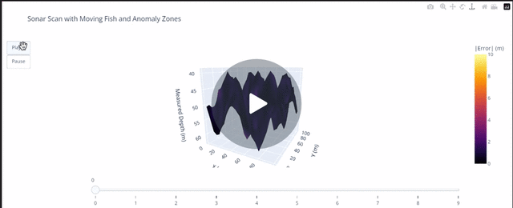

# 🌊 Simulated Sonar Bathymetry Project

This project simulates a sonar-based bathymetric scan of an underwater environment using Python and Plotly in a Jupyter Notebook. It models sonar echo delays, interference from sea creatures and plants, and dynamically visualizes measurement anomalies over time.

---

## 📌 Features

- **Simulated sonar grid sweeps** with realistic echo time-to-depth calculation
- **Underwater interference modeling** from fish and seaweed beds
- **3D surface plots** of measured depths and error zones
- **Animated fish movement** over multiple sonar frames
- **Interactive Plotly slider animation** with play/pause controls
- **Anomaly detection** based on sonar error thresholds

---

## 📁 Project Structure

```
sonar-mapping-project/
│
├── Simulated_Sonar_Bathymetry.ipynb   # Main Jupyter Notebook
├── src/
│   ├── generate_data.py               # Grid and sonar math simulation
│   ├── plot_surface.py                # 3D bathymetric map visualization
│   ├── plot_error_surface.py          # Error-colored true depth surface
│   └── creatures.py                   # Interference modeling for fish and plants
├── data/
│   └── grid_sweep.csv                 # Example dataset from simulation
├── environment.yml                    # Conda environment (optional)
└── README.md                          # This file
```

---

## 🚀 How to Run

1. Install dependencies:
    ```bash
    conda create -n sonar-sim python=3.10
    conda activate sonar-sim
    pip install numpy pandas plotly notebook
    ```

2. Launch the notebook:
    ```bash
    jupyter notebook
    ```

3. Open `Simulated_Sonar_Bathymetry.ipynb` and run all cells.

---

## 🎥 Loom Video Demo

[](https://www.loom.com/share/b9d16d8f4de7404991363b74c2ff3e44?sid=0a5e5005-652b-4452-a129-7f01b3ae4bcd)
---

## 💡 Next Steps

- Add GUI controls with Streamlit or Dash
- Use real-world sonar/bathymetric datasets (e.g. NOAA)
- Export animated sequences to GIF or video

---

## 🧠 Credits & Acknowledgements

Built by Nate Cirino using Python, Plotly, and a lot of fishy math 🐟  
