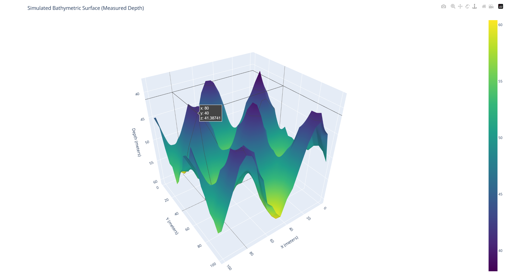
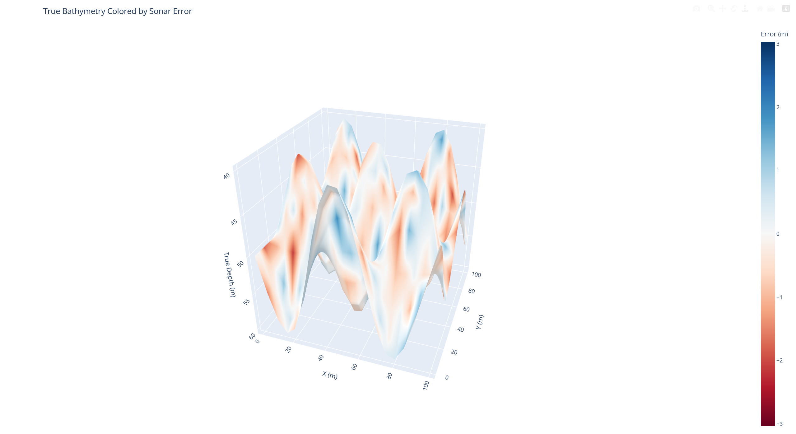

# Sonar-Based Bathymetric Mapping

This project simulates a basic sonar mapping system to generate and visualize underwater topography.

## Features
- Simulates sonar pings and returns
- Generates synthetic bathymetric data
- Visualizes 2D heatmaps and 3D depth surfaces
- (Optional) Arduino-based sonar readings

## Requirements
- Python 3.x
- matplotlib
- numpy
- pandas
- plotly (for 3D)

## demos:

## 2D graph:

## 3D graph simulated bathy 

## 3D graph simulated prospective error vs bathy

Colored based on how far off the sonar measured (error)
    🔵 Blue = underestimating depth
    🔴 Red = overestimating depth

## notes    
Should be saved as a html, and open in ur browser for both graphs once main.py is run.