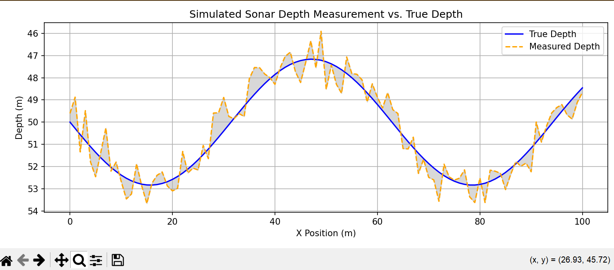

# Sonar-Based Bathymetric Mapping

This project simulates a basic sonar mapping system to generate and visualize underwater topography.

## Features
- Simulates sonar pings and returns
- Generates synthetic bathymetric data
- Visualizes 2D heatmaps and 3D depth surfaces
- (Optional) Arduino-based sonar readings

## Requirements
- Python 3.x
- matplotlib
- numpy
- pandas
- plotly (for 3D)

## EXAMPLE:

## Run the simulation
